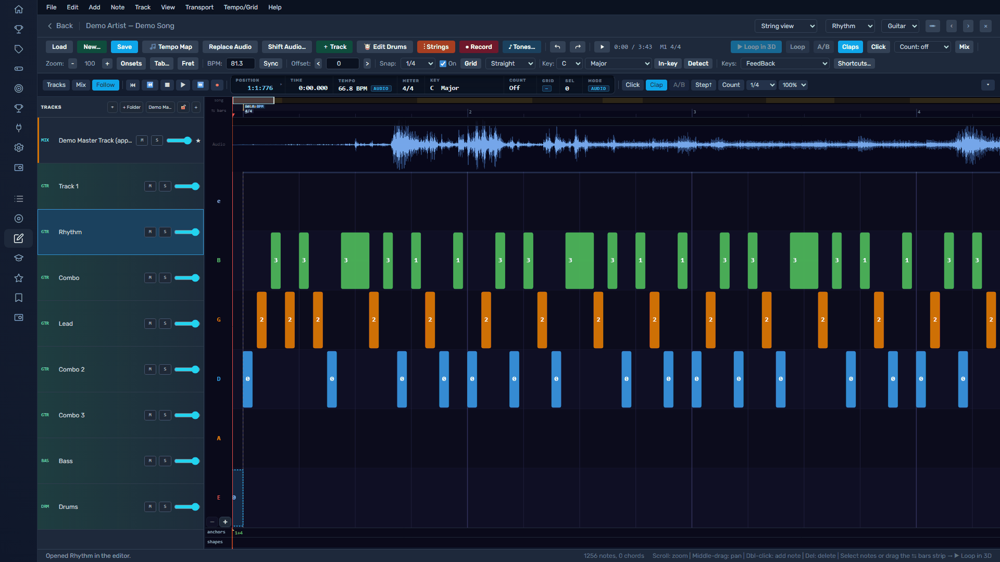

# Importing Tabs and Editing Arrangements

Short answer: the **[Song Editor](../plugins/editor.md)** turns source material — a
Guitar Pro or MIDI file, a MusicXML score, or even a bare recording — into a
playable FeedBack arrangement, and edits any feedpak you already have.

## The Song Editor

Most importing and editing happens in the Song Editor. Open **Song Editor** from
the navigation, then choose **Create New** to import, or **Load…** to open an
existing feedpak.

See the full **[Song Editor guide](../plugins/editor.md)** for the whole
create → chart → build workflow.

## What You Can Import

| Source | Notes |
|---|---|
| Guitar Pro (GP3–GP8) | Notes, tunings, and techniques. |
| MIDI | Notes plus the file's tempo map. |
| MusicXML | Guitar/bass tab, or a keyboard score (keeps left/right hands). |
| Arrangement XML | Community chart files. |
| Audio | A recording to chart from scratch — add a chart alongside it and they auto-sync bar by bar. |
| Existing feedpak | Open any pack to correct it. |

## Common Workflows

| Workflow | Use It For |
|---|---|
| Import a tab file | Start from existing tab/notation data. |
| Song Editor | Fix notes, timing, tempo, sections, tracks, or metadata. |
| Hand edit feedpak | Advanced correction of manifest or JSON files. |
| Validate | Check that the feedpak still loads correctly. |

## Before You Edit

- Work from a copy.
- Keep the original file until the edited version validates.
- Test the edited arrangement in FeedBack.
- Do not distribute content you do not have rights to share.

## Editing Checklist

1. Import or create the arrangement.
2. Confirm title, artist, and arrangement name.
3. Check tuning and string count.
4. Line the beat grid up to the audio (**Tempo Map**).
5. Check note timing.
6. Add or verify sections.
7. **Build** the feedpak, then rescan/import into FeedBack.

## Related Pages

- [Song Editor](../plugins/editor.md)
- [Authoring and Editing](authoring.md)
- [Validating feedpak Files](validation.md)
- [Arrangements](arrangements.md)
