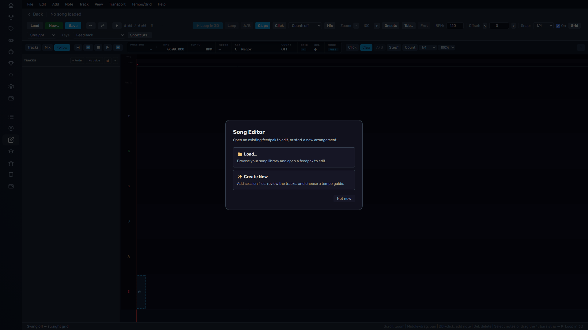
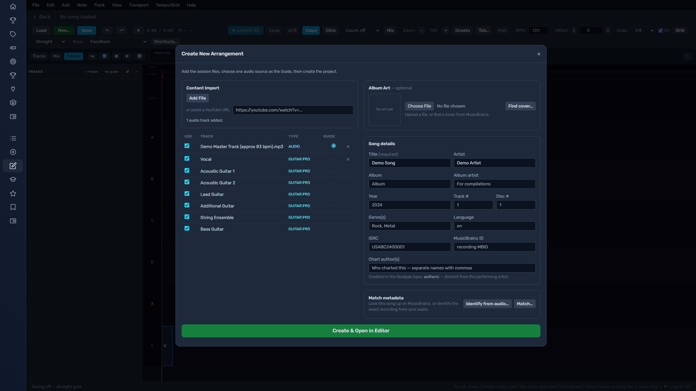
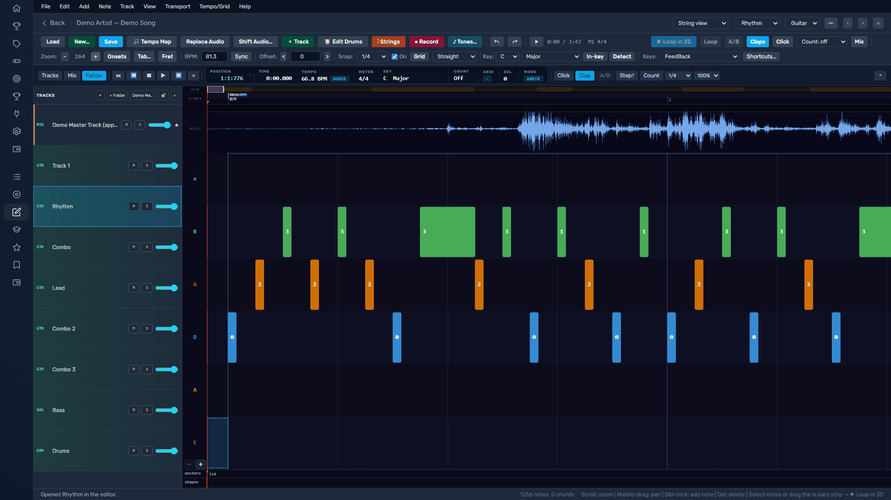
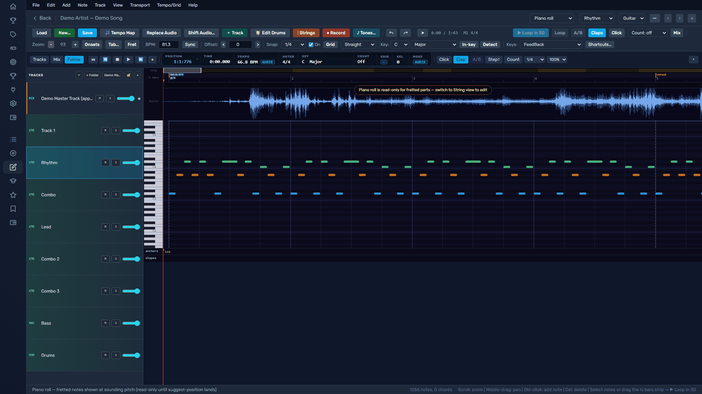
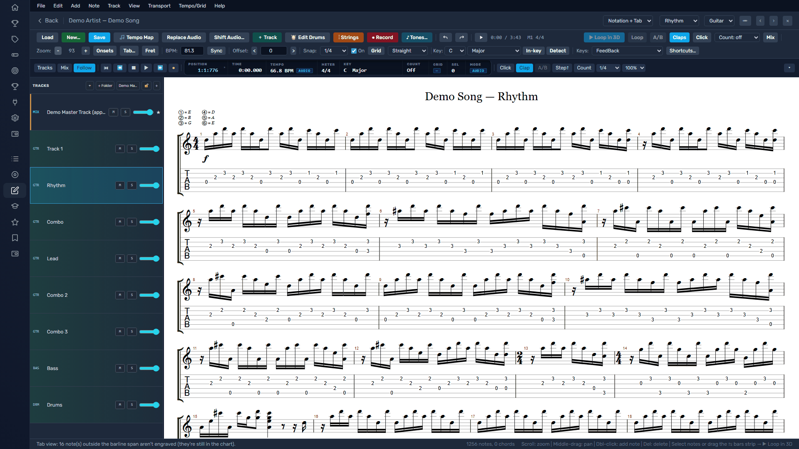
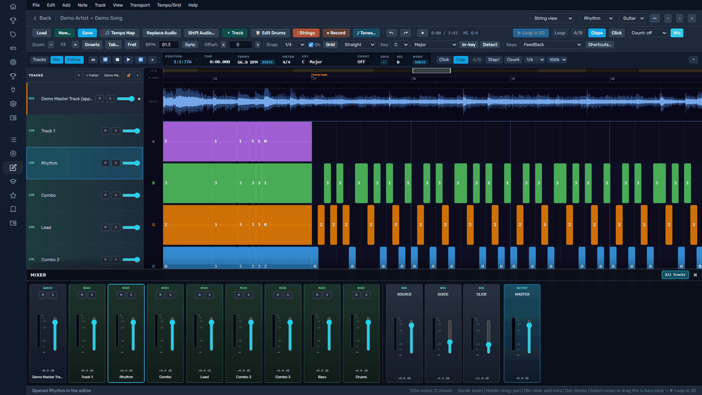
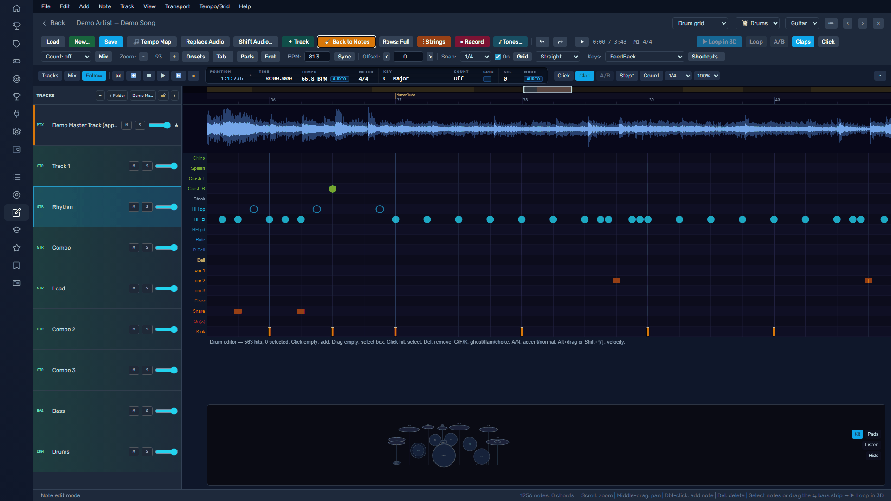

# Song Editor

Short answer: the **Song Editor** turns a recording — or an existing tab — into a
playable FeedBack arrangement. You line a grid up to the music, chart the notes,
add tracks and drums, and build a feedpak the rest of the app can practice against.

The Song Editor is the authoring tool behind the whole library: every feedpak you
play can be opened, corrected, and rebuilt here.

## When To Use This

- You have a recording and want to chart it into a playable arrangement.
- You have a Guitar Pro, MIDI, or MusicXML file and want it as a feedpak.
- You want to fix the notes, timing, sections, tracks, or metadata of an existing feedpak.
- You want to add stems, drums, or a second instrument to a song you already have.

## Open the Editor

Open **Song Editor** from the left navigation. If no song is loaded you land at the
front door:

- **Load…** opens a feedpak from your library to edit.
- **Create New** starts a project from scratch — from audio, a chart, or both.

## Create a Project

**Create New** takes almost anything as a starting point, and you can mix sources:

| Start from | Details |
|---|---|
| A recording | An audio file (MP3, WAV, FLAC, OGG, M4A, OPUS, AAC, WEM) or a YouTube URL. |
| An existing chart | Guitar Pro (GP3–GP8), MIDI (its tempo map comes along), MusicXML (tab or keys), community arrangement XML, or an existing feedpak. |
| Both at once | Add one audio file **and** a chart — **auto-sync** lines the chart up to the recording bar by bar. This is the recommended start. |
| Nothing | Pick your arrangements from the chips and chart on an empty timeline. |

Everything you add lands in one table: every audio source and every track inside
every chart file. Check the tracks you want, choose one audio row as the **Guide**
(the recording the tempo map follows), fill in the song details, then **Create &
Open in Editor**.

!!! note "Nothing touches your library until you Build"
    The editor works on a private session. Save often with `Ctrl+S`; the **Build
    feedpak** step (below) is the only thing that writes to your library.

## The Workspace

- **Menu bar & toolbars** (top) — every command, grouped by what it acts on, plus
  quick toggles for the transport, snap, views, and the BPM / Offset boxes.
- **Tracks column** (left) — the master mix, any stems, and every transcription
  part, each beside its timeline lane. Rename, reorder, fold into folders, resize.
- **Timeline canvas** (center) — the waveform, the beat grid, and your notes. The
  mouse wheel zooms, **Shift+wheel** pans, and the overview strip above the lanes
  is a real horizontal scrollbar for skimming a long song.
- **Transport** (bottom) — play/stop, the playhead clock, loop, count-in,
  metronome, and follow-playhead.
- **Mixer** (`Shift+C`) — vertical channel strips with live meters (see below).

Press **`?`** for the searchable shortcut panel, or **`Ctrl+K`** for the command palette.

## Chart the Notes

Each part gets the view that fits it, chosen from the **view dropdown** (top-right):
**String view**, **Piano roll**, **Notation**, or **Notation + Tab**.

### String view

Colored blocks on per-string lanes — the number on each block is the fret.
Double-click to place a note, drag to move, drag the tail to change its length.

Edit the selection: `F` (or `0`–`9`) sets the fret; `↑`/`↓` move between strings;
`Shift+↑`/`↓` move while keeping the pitch. Toggle techniques with single keys —
`H` hammer-on, `P` pull-off, `B` bend, `S` slide, `M` palm mute, `V` vibrato, and
more under **Note ▸ Techniques**. Press **`T`** for the tool palette (pointer,
pencil/draw, eraser, marquee, mute, scissors).

### Piano roll

Notes as bars on a keyboard, colored by octave — ideal for keys parts, and a
read-only reference for fretted parts (shown at sounding pitch).

### Notation and tab

A live engraved score — standard notation and tablature, following every edit.
Click a beat to select its notes and seek.

## Line the Grid Up (Tempo Mapping)

This is the heart of charting a recording. The grid is **beat-primary**: a note
remembers its bar-and-beat, and its clock time comes from where the barlines sit.
Move the barlines and every note rides along — you fit the grid to the fixed
recording, never the other way around.

Three ways to set the tempo, coarse to fine:

1. **Sync tempo to audio** — detects the recording's BPM and scales the whole grid.
2. **Set a constant BPM** — type into the BPM box for a song at one tempo.
3. **Tempo Map mode** (`T`) — the precise tool. Drag a barline onto its downbeat and
   the surrounding bars re-space. From there: **`G`** suggests downbeats from the
   audio's onsets to the end of the song, **`Shift+B`** taps the tempo, and you can
   **beat-lock** a bar you've verified so later auto-fits leave it alone.

Everything here moves **every track at once** and is undoable — experiment freely.

## Tracks, Stems, and the Mixer

A song can hold several tracks — lead, rhythm, bass, keys, drums — as first-class
objects. From a track's row you can rename it, drag to reorder or drop it into a
folder, set its level / mute / solo, and **pair** a transcription with the studio
stem it was charted against. Load per-instrument **stems** and chart against any of
them in isolation.

The **mixer console** (`Shift+C`) is vertical channel strips with live meters over
the SOURCE / GUIDE / CLICK buses and a MASTER output.

!!! tip "Fretted-track strings and keyboard hands"
    Guitar tracks support 6–8 strings and bass 4–6 — the **− / +** buttons under the
    lowest string change the count. Keys notes can carry a **left/right hand**
    assignment (imported from MusicXML or authored yourself), which drives the
    grand-staff notation's hand split.

## Drums

Drum tracks use a **piece-lane grid**: rows are kit pieces (kick, snare, hats,
toms, ride…), columns are grid positions. Click to place a hit; the **drum pad
strip** below maps a MIDI e-kit or your keyboard for monitoring. The **Rows** button
cycles Full / Compact / GM-roll density.

## Save and Build

- **`Ctrl+S`** saves your working session as you go.
- **Build feedpak** assembles the finished feedpak and writes it to your library —
  the only step that changes what the rest of the app sees. The pack carries
  everything you authored: every arrangement, the tempo map, sections and phrases,
  techniques, keys notation with its hand split, stems, tones, and art.

Rebuild any time; your working session stays editable. **Undo/redo** (`Ctrl+Z` /
`Ctrl+Y`) covers every edit, including tempo moves and imports.

## Shortcut Profiles

The editor ships four keyboard profiles so it matches muscle memory you may already
have: **FeedBack** (the default), **Logical** (Logic-style), **Cableton**
(Ableton-style), and **Legacy (EOF)**. Switch in **Help ▸ Shortcut profile** or the
shortcut panel (`?`). The full, profile-aware list lives in that panel.

## Common Problems

| Problem | Try This |
|---|---|
| The editor buttons do nothing / it never loads | The editor needs a current FeedBack host. Update FeedBack, then reopen it. |
| The chart drifts out of time with the recording | Open **Tempo Map** (`T`) and drag the beat grid onto the audio, or nudge the whole chart with the **Offset** box. |
| An import brought in the wrong instruments | Re-check the track table in **Create New**, or use **File ▸ Import** / **＋ Track** to add the right one. |
| Drum notes were dropped on import | The wizard offers to remap percussion outside the kit vocabulary — accept the remap, or add the drums to an existing project. |
| My build isn't in the library | **Build feedpak** writes to the library; a plain save only updates the working session. |

## Related Pages

- [Importing Tabs and Editing Arrangements](../feedpak/importing-tabs-editor.md)
- [Authoring and Editing feedpak Files](../feedpak/authoring.md)
- [What Is a feedpak?](../feedpak/index.md)
- [Arrangements](../feedpak/arrangements.md)
- [Plugin Directory](directory.md)

## Applies To

Version: FeedBack 0.3.0+ (desktop and web)
Platforms: Windows, macOS, Linux
